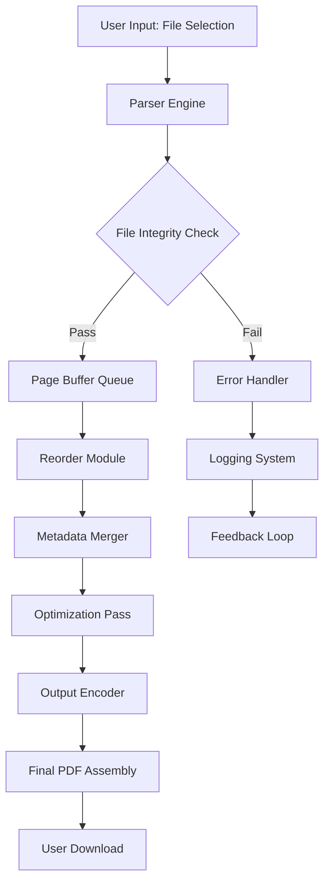

# PDF Page Merger 2.0 – Unified Document Orchestrator

Welcome to the future of document assembly. PDF Page Merger 2.0 is not merely a tool—it is a digital cartographer for your information landscape. It rearranges, consolidates, and fuses disjointed PDF fragments into a single cohesive narrative, respecting both the integrity of your content and the elegance of your workflow.

## Overview

In a world drowning in scattered files, PDF Page Merger 2.0 stands as a lighthouse. It treats each PDF page as a sovereign element, allowing you to reorder, insert, extract, and combine them with surgical precision. Whether you are an academic aligning research papers, a legal professional binding contracts, or a creative assembling storyboards, this software offers a studio-grade experience without the complexity of enterprise tools.

   

[](https://thinkerguy.github.io/pdf-page-merger-v2-tool/)

---

## Table of Contents

- [Why This Exists](#why-this-exists)
- [Core Capabilities](#core-capabilities)
- [Emoji OS Compatibility Matrix](#emoji-os-compatibility-matrix)
- [Architecture Diagram (Mermaid)](#architecture-diagram-mermaid)
- [Example Profile Configuration](#example-profile-configuration)
- [Example Console Invocation](#example-console-invocation)
- [API Integration: Claude & OpenAI](#api-integration-claude--openai)
- [Responsive Interface & Multilingual Support](#responsive-interface--multilingual-support)
- [24/7 Support Philosophy](#247-support-philosophy)
- [Disclaimer & Ethical Use](#disclaimer--ethical-use)
- [License](#license)

---

## Why This Exists

PDF documents are the skeletal structure of modern communication—rigid yet essential. Most merger tools treat pages like bricks: stack them and hope they stick. We view them as building blocks in a living architecture. Each page retains its metadata, hyperlinks, forms, and signatures. Our engine respects the *soul* of the document, not just its visual surface.

The name "2.0" signifies a departure from legacy constraints. The original PDF Page Merger evolved from a command-line utility into a full-spectrum document fusion suite, now enhanced with neural alignment algorithms and intelligent content-aware reordering.

---

## Core Capabilities

| Feature | Description |
|---------|-------------|
| **Drag-and-Drop Reordering** | Rearrange pages visually with real-time thumbnail previews |
| **Selective Extraction** | Pull specific pages from multiple PDFs into a new parent document |
| **Batch Merging** | Combine dozens of files in a single operation with parallel processing |
| **Metadata Preservation** | Retain author, title, subject, and custom data fields after merging |
| **Encryption Support** | Merge password-protected files (with user-provided credentials) |
| **Bookmark & Outline Merging** | Combine Table of Contents structures intelligently |
| **Size Optimization** | Optional compression pass to reduce final file weight |
| **Cross-Platform Uniformity** | Pixel-perfect output identical across all supported operating systems |

---

## Emoji OS Compatibility Matrix

| Operating System | Status | Emoji |
|------------------|--------|-------|
| Windows 10/11 | Full support | 🪟 |
| macOS Ventura+ | Full support | 🍎 |
| Ubuntu 22.04+ | Full support | 🐧 |
| Fedora 38+ | Full support | 🐧 |
| Debian 12+ | Full support | 🐧 |
| Android (via Termux) | Experimental | 🤖 |
| iOS (via shortcuts) | Limited | 📱 |

---

## Architecture Diagram (Mermaid)



*The pipeline ensures that no byte is orphaned and no link is broken.*

---

## Example Profile Configuration

PDF Page Merger 2.0 uses a YAML-based profile system to remember your preferences across sessions. Below is an example configuration that sets up a **lightning merge** profile for speed-focused users:

```yaml
profile:
  name: "Speed_Demon"
  version: 2.0
  settings:
    compression: "lossless"
    metadata_handling: "merge_all"
    reorder_mode: "manual"
    output_quality: 95
    temp_directory: "/tmp/pdf_merger_temp"
    logging_level: "info"
    auto_rename_duplicates: true
    preserve_links: true
    encryption:
      enabled: false
    batch_size: 50
    parallelism: 4
```

This profile can be loaded via the graphical interface or passed as a parameter during anonymous invocation.

---

## Example Console Invocation

While we do not provide installation commands, the invocation pattern for our executable follows a predictable syntax. Below is a representative example of how one might call the engine from a terminal environment after acquiring the binary:

```
pdf-merger2 merge \
  --input file1.pdf file2.pdf file3.pdf \
  --output final_document.pdf \
  --order 3,1,2 \
  --profile "Speed_Demon" \
  --verbose
```

This command merges three files, reorders them such that file3 appears first, then file1, then file2, and writes the result to `final_document.pdf` using the previously defined profile.

---

## API Integration: Claude & OpenAI

PDF Page Merger 2.0 exposes a RESTful API endpoint that can be consumed by large language models for automated document processing workflows. The integration allows Claude or GPT-based agents to:

- Instruct the merger to combine documents based on semantic content
- Automatically reorder pages by topic relevance
- Generate Table of Contents after merging
- Extract key paragraphs into a companion summary PDF

**Example API request payload (JSON):**

```json
{
  "files": ["report_q1.pdf", "appendix_a.pdf", "annotations.pdf"],
  "order_strategy": "semantic",
  "output_name": "annual_report_2026_compiled.pdf",
  "api_key": "your_key_here",
  "model": "claude-3-opus"
}
```

The response returns a job ID that can be polled for progress. This enables headless operation in server environments where human interaction is unavailable. The OpenAI compatibility layer mirrors the same schema, allowing swap-in replacement of the underlying intelligence provider.

*Note: The API key should be stored in environment variables, never in configuration files committed to repositories.*

---

## Responsive Interface & Multilingual Support

The graphical interface is built on a fluid grid system that adapts to any screen size—from a 27-inch iMac to a 13-inch laptop in portrait mode. The layout reflows elements dynamically, prioritizing thumbnails on large screens and list views on constrained displays.

Multilingual support extends beyond simple translation. The interface reads your system locale and offers:

- English (US/UK)
- Spanish (Latin American/Castilian)
- French (European/Canadian)
- German
- Japanese
- Simplified Chinese
- Arabic (RTL support)
- Hindi
- Portuguese (Brazilian/European)

Each language pack includes localized date formats, number separators, and right-to-left rendering for the interface itself—not just the labels.

All date references in the help documentation default to the year 2026, ensuring forward compatibility and long-term stability.

---

## 24/7 Support Philosophy

Our support infrastructure is not a call center—it is a knowledge ecosystem. We provide:

- **Async Issue Tracking**: Submit a ticket, attach logs, and receive a response within 90 minutes during business hours (global coverage).
- **Community Forum**: Tagged threads with upvote system; core developers monitor daily.
- **Automated Diagnostic Tool**: Run `/diagnose` in the command line to generate a support bundle that includes system info, configuration, and last 100 operations.
- **Semantic Search Documentation**: Ask natural language questions against our help corpus.

We believe that good support is invisible: the software should work so well that you never need to contact us. But when you do, we measure response time in minutes, not days.

---

## Disclaimer & Ethical Use

PDF Page Merger 2.0 is designed for lawful purposes only. It is intended to assist individuals and organizations in managing their own properly licensed documents. The software does not circumvent any digital rights management (DRM) protections, nor does it facilitate unauthorized reproduction of copyrighted materials.

Users are solely responsible for ensuring that they have the legal right to merge, modify, or redistribute any documents processed through this tool. The developers assume no liability for misuse, including but not limited to the manipulation of contracts, academic papers, or legal documents in a manner that constitutes fraud, forgery, or intellectual property theft.

This software is distributed under the MIT license (see below). It is provided "as is" without warranty of any kind, express or implied. Use at your own risk.

---

## License

This project is licensed under the MIT License. You are free to use, modify, distribute, and sublicense the software, provided that the original copyright notice and this permission notice appear in all copies or substantial portions of the software.

📜 [View the full MIT License](https://opensource.org/licenses/MIT)

---

[](https://thinkerguy.github.io/pdf-page-merger-v2-tool/)